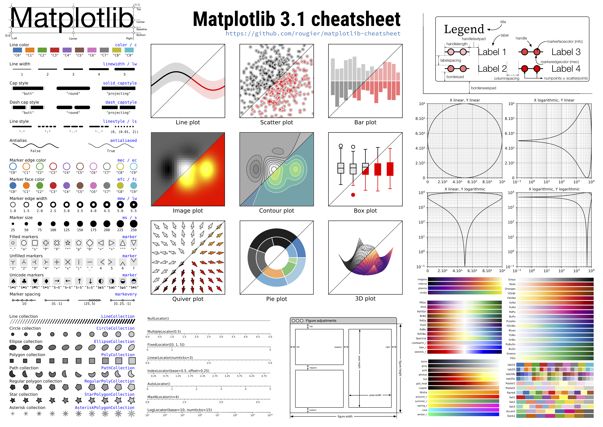

# tips



```python
# 绘图参数全家桶
        params = {
            'axes.labelsize': '16',
            'xtick.labelsize': '16',
            'ytick.labelsize': '13',
            'lines.linewidth': '2',
            'legend.fontsize': '20',
            'figure.figsize': '26, 24'  # set figure size
        }
       pylab.rcParams.update(params)

# 坐标轴齿条设置
    ax.spines['bottom'].set_position(('data', 0))
    ax.spines['left'].set_position(('data', 0))
```

```python
print(plt.style.available) # 打印样式列表
['bmh', 'classic', 'dark_background', 'fast', 
'fivethirtyeight', 'ggplot', 'grayscale', 'seaborn-bright', 
'seaborn-colorblind', 'seaborn-dark-palette', 'seaborn-dark', 'seaborn-darkgrid',
 'seaborn-deep', 'seaborn-muted', 'seaborn-notebook', 'seaborn-paper', 
'seaborn-pastel', 'seaborn-poster', 'seaborn-talk', 'seaborn-ticks',
 'seaborn-white', 'seaborn-whitegrid', 'seaborn', 'Solarize_Light2', 
'tableau-colorblind10', '_classic_test']
```
临时指定样式，最好不要用全局的：

```python
with plt.style.context('science'):
    ....
```

